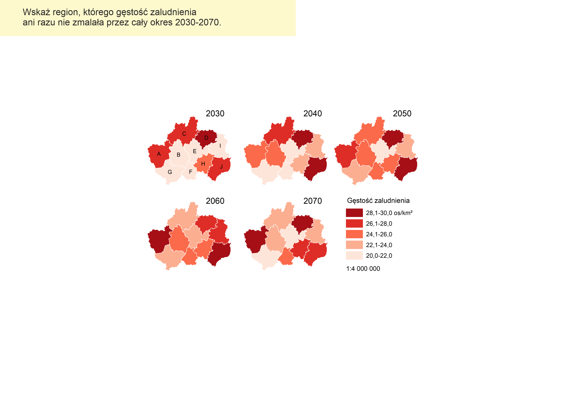
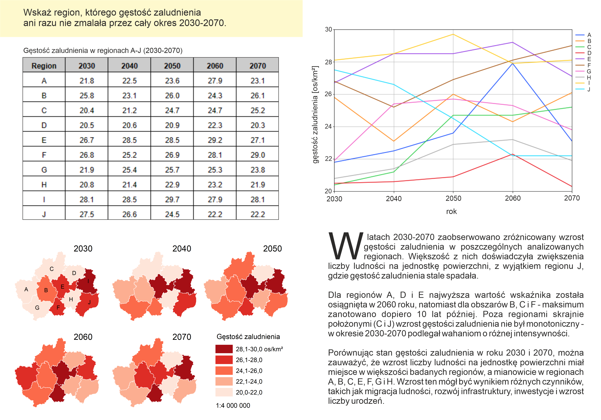
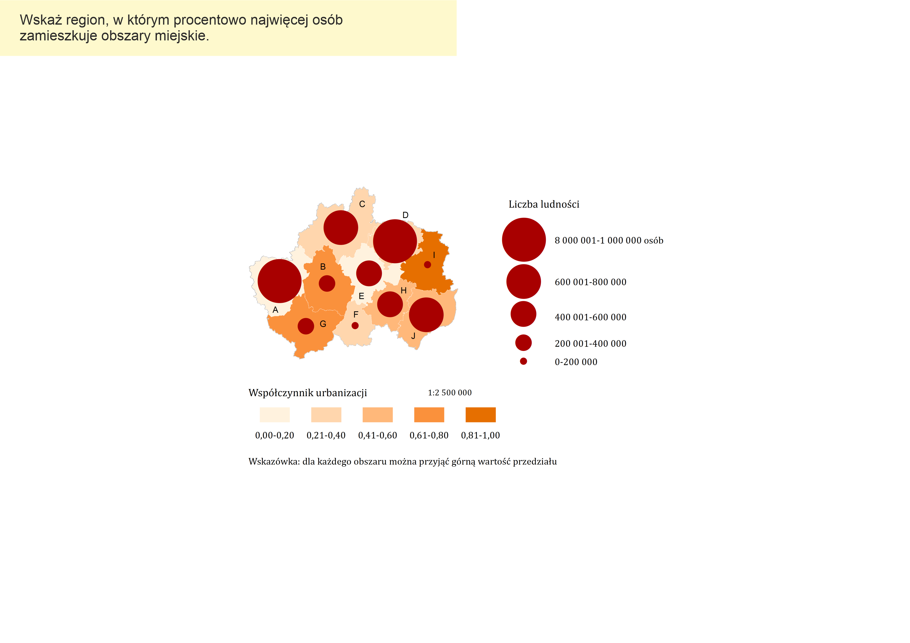
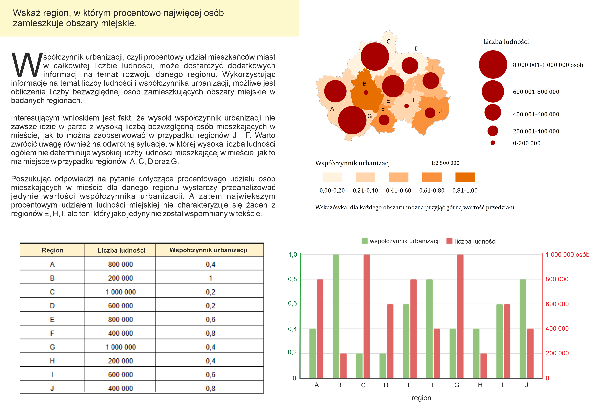
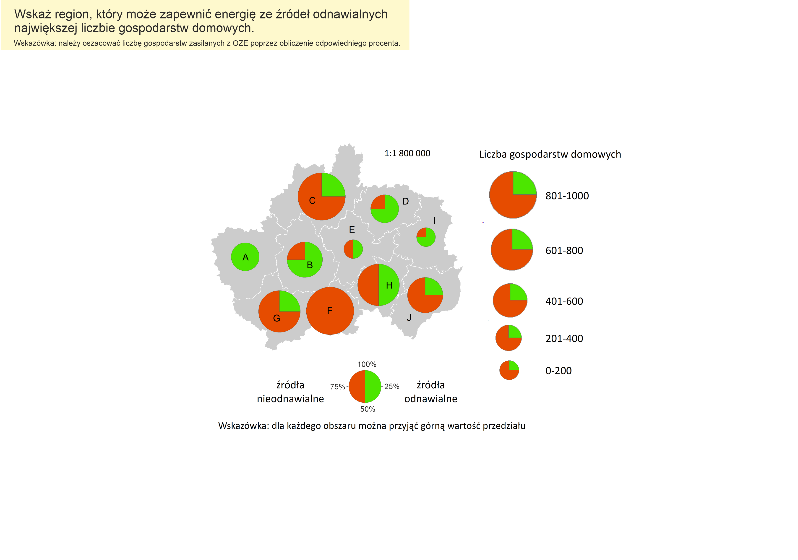
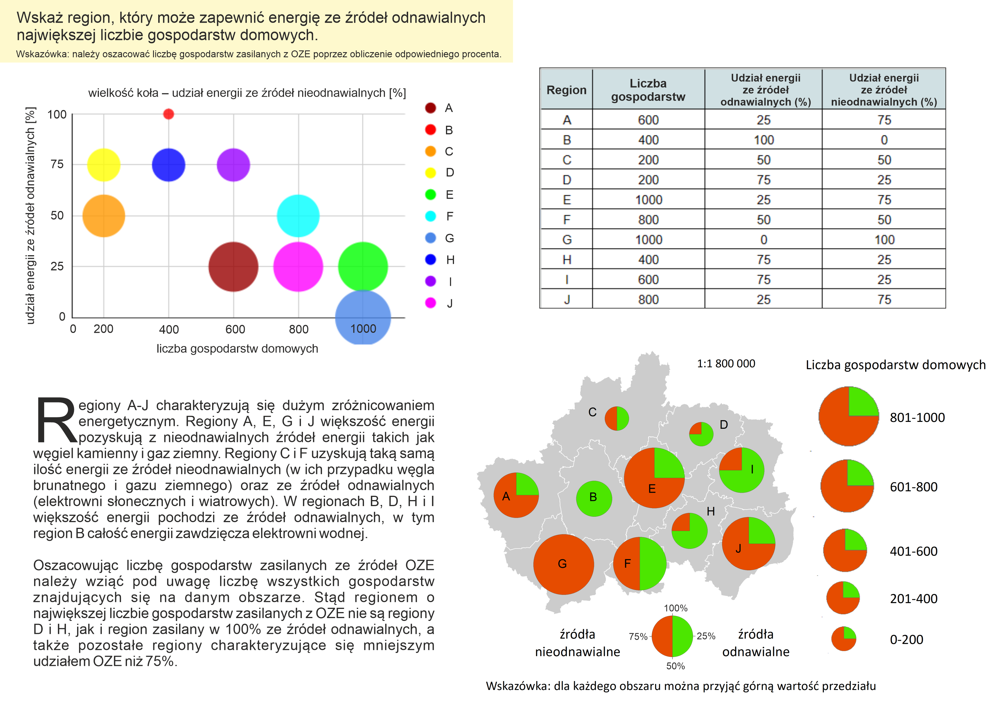

# The impact of redundancy on map user perception. Comparison of the usefulness of a map presented alone and together with other forms of data presentation.

## Master's thesis conducted at the Faculty of Geography and Regional Studies, University of Warsaw

### Abstract

Within the framework of the present work, a study was carried out of the effect of redundancy of information presented by means of various forms of data presentation on the perception of the map user, studied by usability indicators: correctness, response time and task difficulty rating. Particular attention was paid to the process of using the map, whose stand-alone presentation and co-presentation with graph, table and text were compared in the experiment. Separate analysis was also made of the relationships between the four forms of presentation mentioned above occurring together. The study in the within-group scheme was conducted using eye tracking to obtain data on when and where the subjects' gaze was focused. In addition, data on the personal characteristics and predispositions of the participants were obtained using a questionnaire. At the stage preceding the empirical study, the history of the development of the eye tracking method was presented, the operation of the modern eye tracker was described, and the applications of the method in various fields of science and business were introduced, with particular emphasis on the research carried out in the field of mapping utility and redundancy. The processes of planning, preparation, conducting the study in the present work and the tools and software used (ArcMap, Corel Draw, Tobi Pro Lab, Python programming language) are characterized. The results obtained are presented descriptively and graphically, and the full results of each analysis are included as appendices. Conclusions from the performed experiment are formulated, and a discussion of the obtained results is carried out in the context of previous research conducted in this area.

### Keywords
- eye tracking
- redundancy
- map user perception
- forms of presentation
- map
- python

### Stimuli

The analyzed data in this repository was collected during the study using the following two types of materials prepared by me: 
- single map (containing only a map) and
- multiple forms (containing a map, table, chart, text presenting the same information).

| Task  | Single map  | Multiple forms  |  
|---|---|---|
| Task 1 - Analysis of temporal changes |  |  | 
| Task 2 - Finding extremes in the selected scope of data  |  |  | 
| Task 3 - Recalculating values of quantitative data  |  |  | 

Prepared usingL ArcMap, Python, Corel Draw.

### Methodology

1. Independent variables: 
- redundancy (main variable);
- task difficulty (confounding variable): task 1: the easiest one, task 2: moderate difficulty; task 3: the most difficult;
- personal features (confounding variables).

2. Dependent variables: 
- the usability performance metrics: correctness, response time, and task difficulty rating;
- eye-tracking metrics: total and average fixation duration, number of fixations, average
pupil size, total and average visit duration, and number of visits.

3. Study design

Within-subjects design.

4. Participants

The 41 undergraduate students of geography or spatial management, Faculty of Geography and Regional Studies, University of Warsaw. 

5. Eye tracking study

The study was conducted using a 17-inch MSI GV72 7RD laptop with a resolution of 1920×1980. Eye tracking data was recorded using a Tobii X120 eye tracker with a sampling resolution of 120 Hz.

6. Analysis tools

Statistical tests performed using Python (e.g. statsmodels, scipy, scikit-posthocs, pingouin, numpy, pandas) - results are in this repository.

### Repository structure

This repository contains Python scripts used to analyze the data collected during the study. 
The data is not included in this repository.
In the `functions` folder, there are Python scripts with functions used in the analysis.
In the `statistical_tests` folder, there are Python scripts with statistical tests used in the analysis.

Tests contain the following: 
- `general` - some basic statistical tests, conducted on the whole dataset;
- `redundancy` - statistical tests conducted on the dataset divided into groups based on the redundancy level.

### Discussion

Redundancy affects perception differently depending on task complexity (adding the
importance of difficulty to previous results, e.g. Matsukawa, Miyata, and Ueda 2009).

Participants fixated at various forms of presentation and found them helpful (supporting
results of Edsall 2003). Map was viewed for a shorter time when displayed together with
other visualization forms.

Charts were one of the most frequently chosen forms, while text was chosen the least
often (similar to results on preference toward charts by Koua, MacEachren, and Kraak,
2007; Liu, Lai, and Chuang, 2011).

### Conclusion

Redundancy does not uniformly impact the analyzed performance metrics:

Redundancy increase participants response time. 
- For simple tasks, redundancy improves answer correctness and makes the task perceived as easier.
- For difficult tasks, redundancy decreases correctness and makes the task perceived as more difficult.

In the multiple forms solution, the map served as an information source OR as a double-check, whereas when presented as a single form, the map served BOTH functions.

### Publication

The results of this work were presented during EuroCarto 2024 in Vienna on 9-11 September 2024. The abstract of the presentation was published at the following address: https://ica-abs.copernicus.org/articles/7/161/2024/.

**Author**: Marta Solarz
